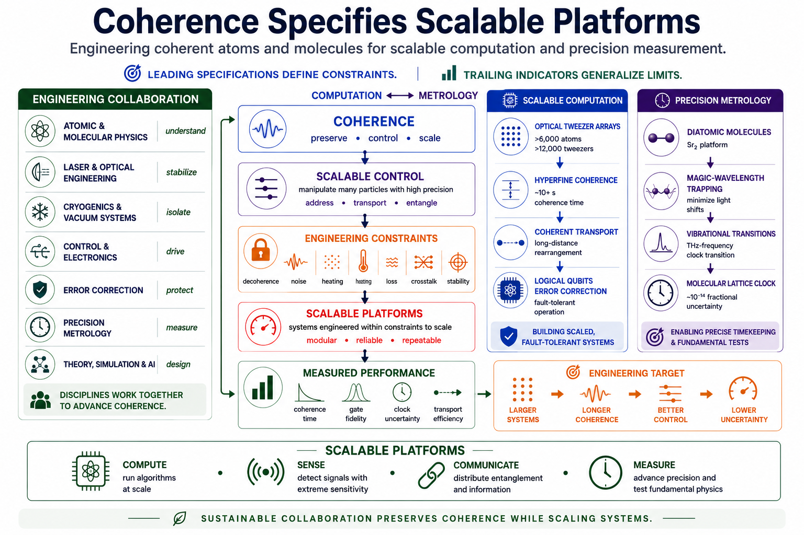

# Scalable Quantum Platforms



## Coherence Specifies Scalable Platforms

Engineering coherent atoms and molecules for scalable computation and precision measurement.

## Repository roadmap

- 00 — Context
- 07 — Optical Tweezer Scaling
- 13 — Hyperfine Coherence
- 17 — Coherent Transport
- 23 — Error Correction
- 29 — Magic-Wavelength Engineering
- 37 — Molecular Clocks
- 41 — Coherence as an Engineering Resource
- 47 — Scalable Platforms

## Structure

```
figures/
notebooks/
src/
requirements.txt
```
